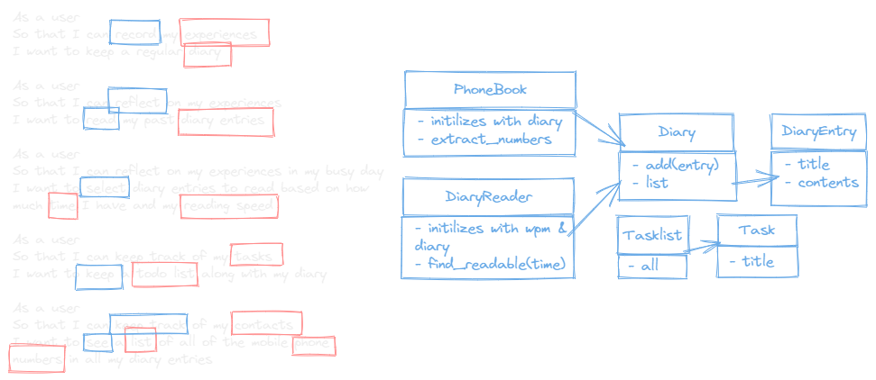

# Multi-Class Planned Design Recipe

## 1. Describe the Problem

As a user
So that I can record my experiences
I want to keep a regular diary

As a user
So that I can reflect on my experiences
I want to read my past diary entries

As a user
So that I can reflect on my experiences in my busy day
I want to select diary entries to read based on how much time I have and my reading speed

As a user
So that I can keep track of my tasks
I want to keep a todo list along with my diary

As a user
So that I can keep track of my contacts
I want to see a list of all of the mobile phone numbers in all my diary entries

## 2. Design the Class System

_Consider diagramming out the classes and their relationships. Take care to
focus on the details you see as important, not everything. The diagram below
uses asciiflow.com but you could also use excalidraw.com, draw.io, or miro.com_



_Also design the interface of each class in more detail._

```ruby
class Diary
  def add(entry) # entry is a DiaryEntry
    # ...
  end

  def entries # returns an array of DiaryEntry objects
    # ...
  end
end

class DiaryEntry
  def initialize(title, contents) # title and contents are strings
    # ...
  end

  def title  # returns a string
    # ...
  end

  def contents # returns a string
    # ...
  end
end

class PhoneBook
  def initialize(diary) # diary is a instance of Diary
    # ...
  end

  def extract_numbers # returns an array of phone numbers
    # ...
  end
end

class DiaryReader
  def initialize(wpm, diary) # diary is a instance of Diary and wpm is an integer of number of words per minute reader can read
    # ...
  end

  def find_readable(time) # time is a string of time in minutes and returns instance of DiaryEntry. If no entry is readable, returns nil
    # ...
  end
end

class Tasklist
  def all(task) # task is a string of a task and returns an array of DiaryEntry objects
    # ...
  end

  def add
    # ...
  end
end

class Task
  def initialize(title) # title is a string
    # ...
  end

  def title # returns a string
    # ...
  end
end
```
## 3. Create Examples as Integration Tests
_Create examples of the classes being used together in different situations and
combinations that reflect the ways in which the system will be used._
```ruby
# EXAMPLE

# As a user
# So that I can record my experiences
# I want to keep a regular diary

# As a user
# So that I can reflect on my experiences
# I want to read my past diary entries

# 1
diary = Diary.new
entry = DiaryEntry.new("My first entry", "I had a great day!")
diary.add(entry)
expect(diary.entries).to eq([entry])

----------------------------------------------------------------
# As a user
# So that I can reflect on my experiences in my busy day
# I want to select diary entries to read based on how much time I have and my reading speed

# 2  - fits perfectly
diary = Diary.new
reader = DiaryReader.new(2, diary)
entry = DiaryEntry.new("My first entry", "I had a great day!")
entry2 = DiaryEntry.new("My second entry", "terrible day!")
diary.add(entry)
diary.add(entry2)
expect(reader.find_readable(2)).to eq([entry])

# 3 - doesnt fit exactly
diary = Diary.new
reader = DiaryReader.new(2, diary)
entry = DiaryEntry.new("My first entry", "great day!")
entry2 = DiaryEntry.new("My second entry", "not terrible day!")
entry3 = DiaryEntry.new("My third entry", "I had a terrible day!")
diary.add(entry)
diary.add(entry2)
diary.add(entry3)
expect(reader.find_readable(2)).to eq([entry2])

# 4 - nothing is readable
diary = Diary.new
reader = DiaryReader.new(2, diary)
entry = DiaryEntry.new("My first entry", "I had a great day!")
diary.add(entry)
expect(reader.find_readable(2)).to eq nil

# 5 - nothing at all
diary = Diary.new
reader = DiaryReader.new(2, diary)
expect(reader.find_readable(2)).to eq nil

# 6 - wmp invalid
diary = Diary.new
reader = DiaryReader.new(0, diary) # fail as wmp is zero

----------------------------------------------------------------
# As a user
# So that I can keep track of my tasks
# I want to keep a todo list along with my diary

# 7
task_list = Tasklist.new
task = Task.new("My first task")
task_list.add(task)
expect(task_list.all("My first task")).to eq([entry])

----------------------------------------------------------------
# As a user
# So that I can keep track of my contacts
# I want to see a list of all of the mobile phone numbers in all my diary entries

# 8 
diary = Diary.new
phone_book = PhoneBook.new(diary)
diary.add(DiaryEntry.new("My first entry", "I had a great day!"))
diary.add(DiaryEntry.new("My second entry", "terrible day!, 1234567890"))
expect(phone_book.extract_numbers).to eq(["1234567890"])

# 9
diary = Diary.new
phone_book = PhoneBook.new(diary)
diary.add(DiaryEntry.new("My first entry", "I had a great day!"))
diary.add(DiaryEntry.new("My second entry", "terrible day!, 1234567890"))
diary.add(DiaryEntry.new("My third entry", "I had a terrible day!, 1234567891"))
expect(phone_book.extract_numbers).to eq(["1234567890, 1234567891"])

# 10
task_list = TaskList.new
task = Task.new("Today I went to the park")
task2 = Task.new("Today I went to the school")
task_list.add(task)
task_list.add(task2)
expect(task_list.all).to eq [task, task2]
```

## 4. Create Examples as Unit Tests

_Create examples, where appropriate, of the behaviour of each relevant class at
a more granular level of detail._

```ruby
# 1 - empty list of entries
diary = Diary.new
expect(diary.entries).to eq []

# 2 - add tasks to list
task_list = TaskList.new
task = Task.new("Today I went to the park")
task2 = Task.new("Today I went to the school")
task_list.add(task)
task_list.add(task2)
expect(task_list.all).to eq [task, task2]

# 3 - returns empty if no tasks were found
task_list = TaskList.new
expect(task_list.all).to eq []
```

_Encode each example as a test. You can add to the above list as you go._

## 5. Implement the Behaviour

_After each test you write, follow the test-driving process of red, green,
refactor to implement the behaviour._
