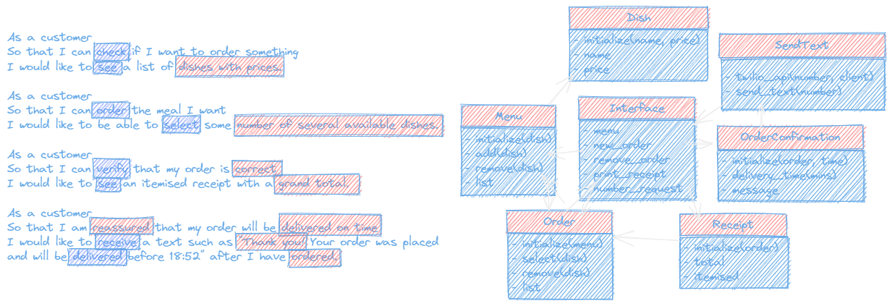

# Takeaway Planned Design Recipe

## 1. Describe the Problem

As a customer
So that I can check if I want to order something
I would like to see a list of dishes with prices.

As a customer
So that I can order the meal I want
I would like to be able to select some number of several available dishes.

As a customer
So that I can verify that my order is correct
I would like to see an itemised receipt with a grand total.

As a customer
So that I am reassured that my order will be delivered on time
I would like to receive a text such as "Thank you! Your order was placed and will be delivered before 18:52" after I have ordered.

## 2. Design the Class System

_Diagram of the classes and their relationships._



_Design interface of each class in more detail._

```ruby
class Menu
  def initialize(dish) # 
  end

  def add(dish) # dish is a instance of Dish, adds dish to the menu.
  end

  def remove(dish) # dish is a string, removes dish from the menu.
  end

  def list
  end
end

class Dish
  def initialize(name, price) # name is a string, price is a float.
  end

  def name # returns the name of the dish.
  end

  def price  # returns the price of the dish.
  end
end

class Order
  def initialize(menu) # menu is a string
  end

  def select(dish) # dish is a string, adds dish to the order.
  end

  def remove(dish) # dish is a string, removes dish from the order.
  end
end

class Receipt
  def initialize(order) # order is an instance of Order
  end

  def total # returns the total price of the order.
  end

  def itemised # returns a string with the itemised receipt.
  end
end

class OrderConfirmation
  def initialize(number) # number is a string
  end

  def send_text # sends a text to the customer.
  end
end

class Interface
  def initialize()
  end

  def menu # returns the menu.
  end

  def new_order # returns a new order.
  end

  def number_request # returns a string and ask user to enter phone number.
  end

  def print_receipt # prints the receipt.
  end
end
```
## 3. Create Examples as Integration Tests

_Examples of the classes being used together in different situations and
combinations that reflect the ways in which the system will be used._

```ruby
# EXAMPLES

# As a customer
# So that I can check if I want to order something
# I would like to see a list of dishes with prices.

# As a customer
# So that I can order the meal I want
# I would like to be able to select some number of several available dishes.

# 1 - add new dish to menu list
Pizza = Dish.new("Pizza", 10)
Pasta = Dish.new("Pasta", 8)
Sourry_Soup = Dish.new("Sourry Soup", 5)
Salad = Dish.new("Salad", 6)
menu = Menu.new
menu.add(Pizza)
menu.add(Pasta)
menu.add(Sourry_Soup)
menu.add(Salad)
expect(menu.list).to eq(["Pizza : 10", "Pasta : 8", "Sourry Soup : 5", "Salad : 6"])]) 

# 2 - remove a dish from menu list
Pizza = Dish.new("Pizza", 10)
Pasta = Dish.new("Pasta", 8)
Sourry_Soup = Dish.new("Sourry Soup", 5)
Salad = Dish.new("Salad", 6)
menu = Menu.new
menu.add(Pizza)
menu.add(Pasta)
menu.add(Sourry_Soup)
menu.remove(Salad)
expect(menu.list).to eq(["Pizza", "Pasta", "Sourry Soup"])

# 3 - add dishes to new order and gives out total
Pizza = Dish.new("Pizza", 10)
Pasta = Dish.new("Pasta", 8)
Sourry_Soup = Dish.new("Sourry Soup", 5)
Salad = Dish.new("Salad", 6)
menu = Menu.new
menu.add(Pizza)
menu.add(Pasta)
menu.add(Sourry_Soup)
menu.add(Salad)
order = Order.new(menu)
order.select(Pizza)
order.select(Pasta)
order.select(Sourry_Soup)
order.select(Salad)
receipt = Receipt.new(order)
expect(receipt.total).to eq("Your total is: £29")

# 4 - remove dishes from order and gives out total
Pizza = Dish.new("Pizza", 10)
Pasta = Dish.new("Pasta", 8)
Sourry_Soup = Dish.new("Sourry Soup", 5)
Salad = Dish.new("Salad", 6)
menu = Menu.new
menu.add(Pizza)
menu.add(Pasta)
menu.add(Sourry_Soup)
menu.add(Salad)
order = Order.new(menu)
order.select(Pizza)
order.select(Pasta)
order.select(Sourry_Soup)
order.remove(Salad)
receipt = Receipt.new(order)
expect(receipt.total).to eq("Your total is: £23")
----------------------------------------------------------------

# As a customer
# So that I can verify that my order is correct
# I would like to see an itemised receipt with a grand total.

# 5 - print itemised receipt
Pizza = Dish.new("Pizza", 10)
Pasta = Dish.new("Pasta", 8)
Sourry_Soup = Dish.new("Sourry Soup", 5)
Salad = Dish.new("Salad", 6)
menu = Menu.new
menu.add(Pizza)
menu.add(Pasta)
menu.add(Sourry_Soup)
menu.add(Salad)
order = Order.new(menu)
order.select(Pizza)
order.select(Pasta)
order.select(Sourry_Soup)
order.remove(Salad)
receipt = Receipt.new(order)
expect(receipt.itemised).to eq(
  "Pizza : £10
  Pasta : £8
  Sourry Soup : £5
  Salad : £6
  Your total is: £23"
  )
----------------------------------------------------------------

# As a customer
# So that I am reassured that my order will be delivered on time
# I would like to receive a text such as "Thank you! Your order was placed and will be delivered before 18:52" after I have ordered.

Pizza = Dish.new("Pizza", 10)
Pasta = Dish.new("Pasta", 8)
Sourry_Soup = Dish.new("Sourry Soup", 5)
Salad = Dish.new("Salad", 6)
menu = Menu.new
menu.add(Pizza)
menu.add(Pasta)
menu.add(Sourry_Soup)
menu.add(Salad)
order = Order.new(menu)
order.select(Pizza)
order.select(Pasta)
order.select(Sourry_Soup)
order.remove(Salad)
receipt = Receipt.new(order)
confirmation = OrderConfirmation.new(receipt.itemised)
expect(confirmation.send_text).to eq("Thank you! Your order was placed and will be delivered before 18:52")
```

## 4. Create Examples as Unit Tests

_Examples of the behaviour of each relevant class at
a more granular level of detail._

```ruby
# 1 - list name of dish
dish = Dish.new("Pizza", 10)
expect(dish.name).to eq("Pizza")

# 2 - list price of dish
dish = Dish.new("Pizza", 10)
expect(dish.price).to eq(10)

# 3 - returns empty if no dishes were found
menu = Menu.new
expect(menu.list).to eq([])
```
## 5. Implement the Behaviour

_Each tests follows the test-driving process of red, green,
refactor to implement the behaviour._
