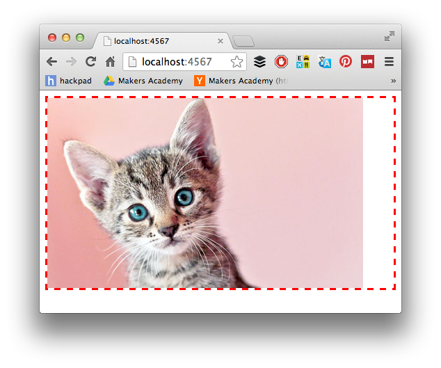

# Sinatra: Returning HTML

We've created a web application that returns basic strings as responses to client requests.

Most web applications don't return basic strings: they return advanced HTML documents, along with CSS (for styling), Javascript (for interaction effects), and other assets (like images, videos, and audio).

In this challenge, you will substitute your basic response strings with some HTML.

### Challenge Setup

By the end of this challenge, you should see (in your browser) something like this:

### Learning Objectives Covered

By learning how to add more routes to your Sinatra application, you are working towards:

* Explain and diagram the HTTP request/response cycle
* Test-drive a simple Sinatra app

### To complete this challenge, you will need to:

- [x] Define a new route, called `get '/cat'`.
- [x] Using this image: https://i.imgur.com/jFaSxym.png, return an HTML string from the route that displays a cat photograph surrounded by a red dashed border.

### Resources

- [Sinatra Main Intro Documentation](http://www.sinatrarb.com/intro.html)
- [CSS Borders (Mozilla Developer Network)](https://developer.mozilla.org/en/docs/Web/CSS/border)