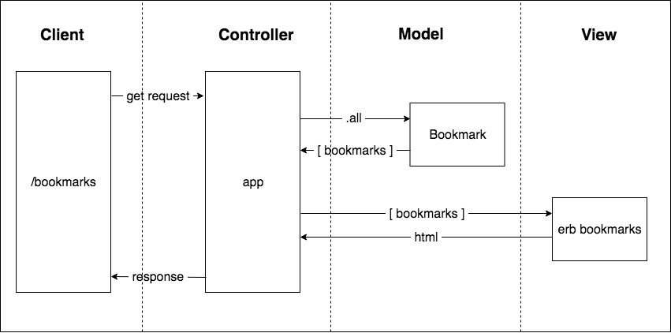

Domain Model:

- When the user visits the '/bookmarks' path, their browser sends a request to a controller we built.
- When the controller gets the request, it asks the `Bookmark` class to give it all the bookmarks, i.e. the controller asks for `Bookmark.all`.
- The `Bookmark` class goes and gets the bookmarks, and gives back all the bookmarks in an array to the controller.
- The controller renders the array of bookmarks to a webpage, which it sends as a response to the user

So, it feels like the first things we need are:
 - a Controller
 - a Bookmark class
 - A bookmark view