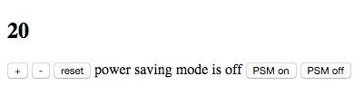
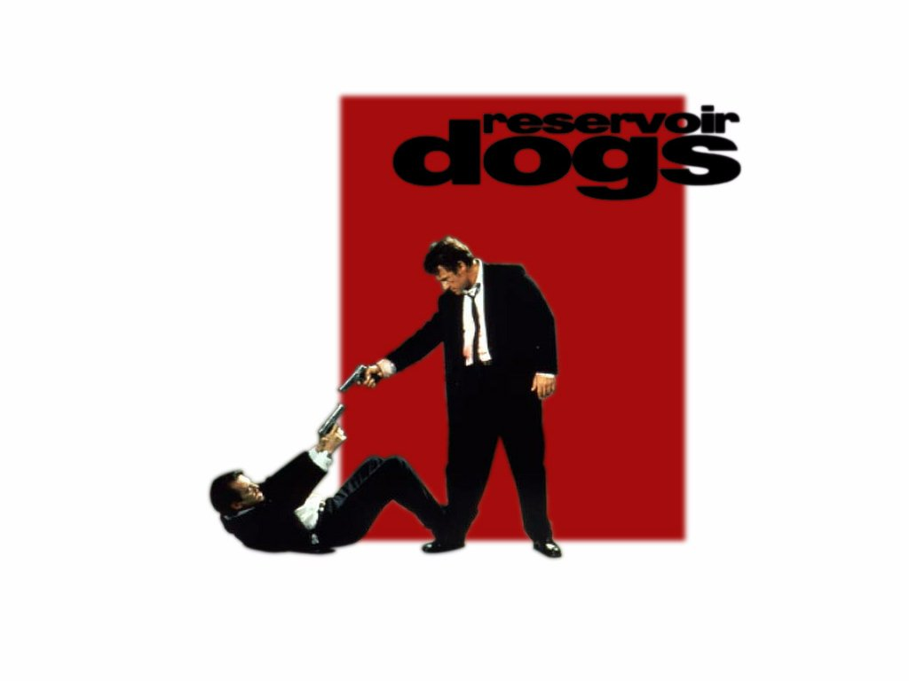
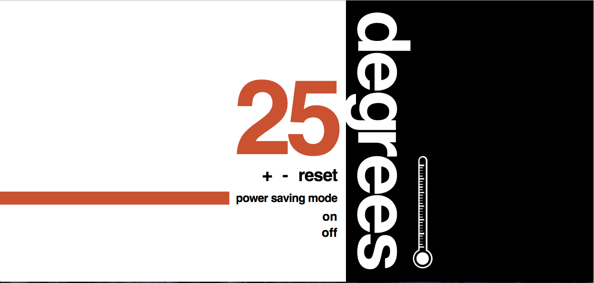

# Thermostat: styling

[Back to the Challenge Map](README.md)

While fully functional, it's rare to see a thermostat (or any app, really) in this sad state:

Instead, what we really want is something exploding with awesome, maybe even looking a bit like a Reservoir Dogs poster:

Or, influenced by whatever else you take your visual inspiration from.

### Learning Objectives covered

### To complete this challenge, you will need to:

- [ ] Style the thermostat.  Go wild!

### Resources

- [Learn layout](http://learnlayout.com/)

### Walkthrough

There's no detailed walkthrough for this challenge.  How much and what styling you'd like to do is up to you.  However, the [walkthrough](walkthroughs/styling.md) does contain some questions to consider when styling your thermostat.

[Next Challenge](./saving_state.md)

<!-- BEGIN GENERATED SECTION DO NOT EDIT -->

---

**How was this resource?**  
[😫](https://airtable.com/shrUJ3t7KLMqVRFKR?prefill_Repository=makersacademy/course&prefill_File=thermostat_es6/styling.md&prefill_Sentiment=😫) [😕](https://airtable.com/shrUJ3t7KLMqVRFKR?prefill_Repository=makersacademy/course&prefill_File=thermostat_es6/styling.md&prefill_Sentiment=😕) [😐](https://airtable.com/shrUJ3t7KLMqVRFKR?prefill_Repository=makersacademy/course&prefill_File=thermostat_es6/styling.md&prefill_Sentiment=😐) [🙂](https://airtable.com/shrUJ3t7KLMqVRFKR?prefill_Repository=makersacademy/course&prefill_File=thermostat_es6/styling.md&prefill_Sentiment=🙂) [😀](https://airtable.com/shrUJ3t7KLMqVRFKR?prefill_Repository=makersacademy/course&prefill_File=thermostat_es6/styling.md&prefill_Sentiment=😀)  
Click an emoji to tell us.

<!-- END GENERATED SECTION DO NOT EDIT -->
